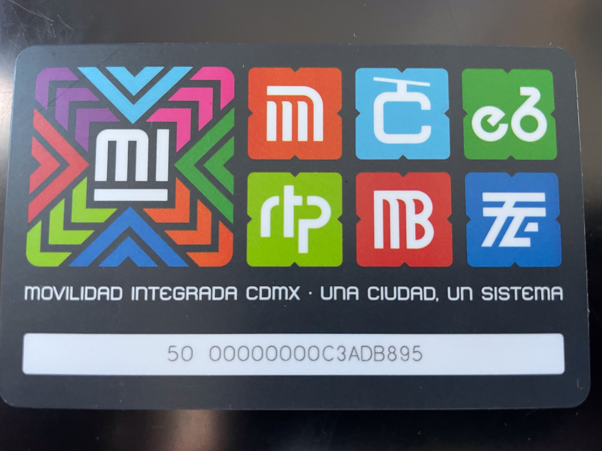
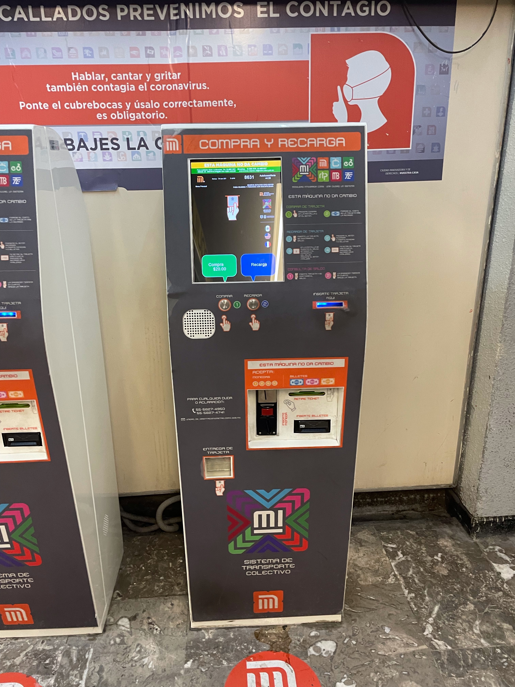
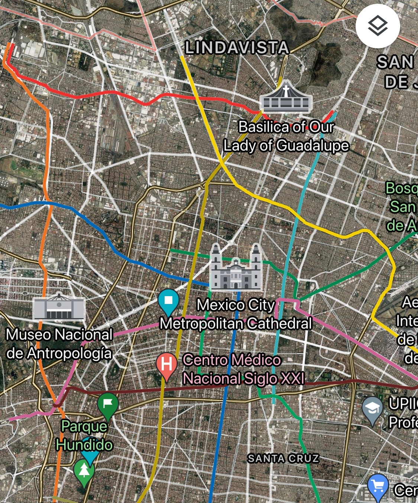
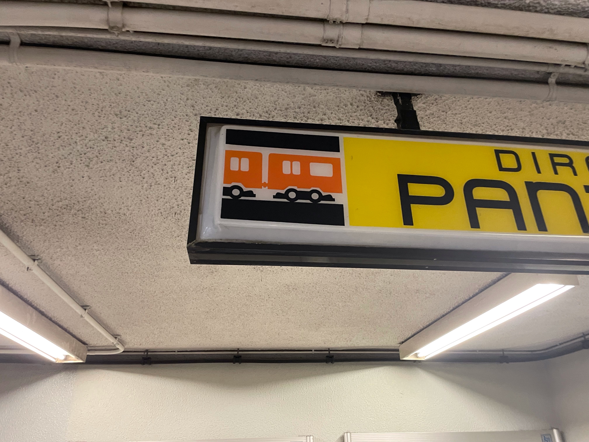
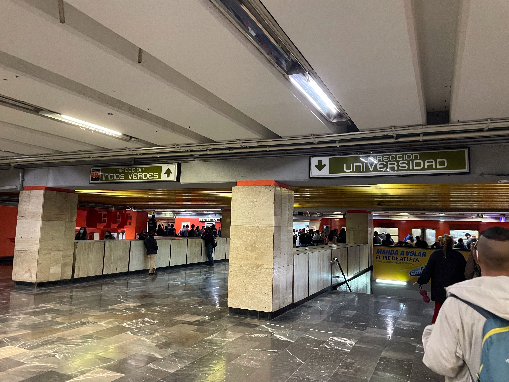
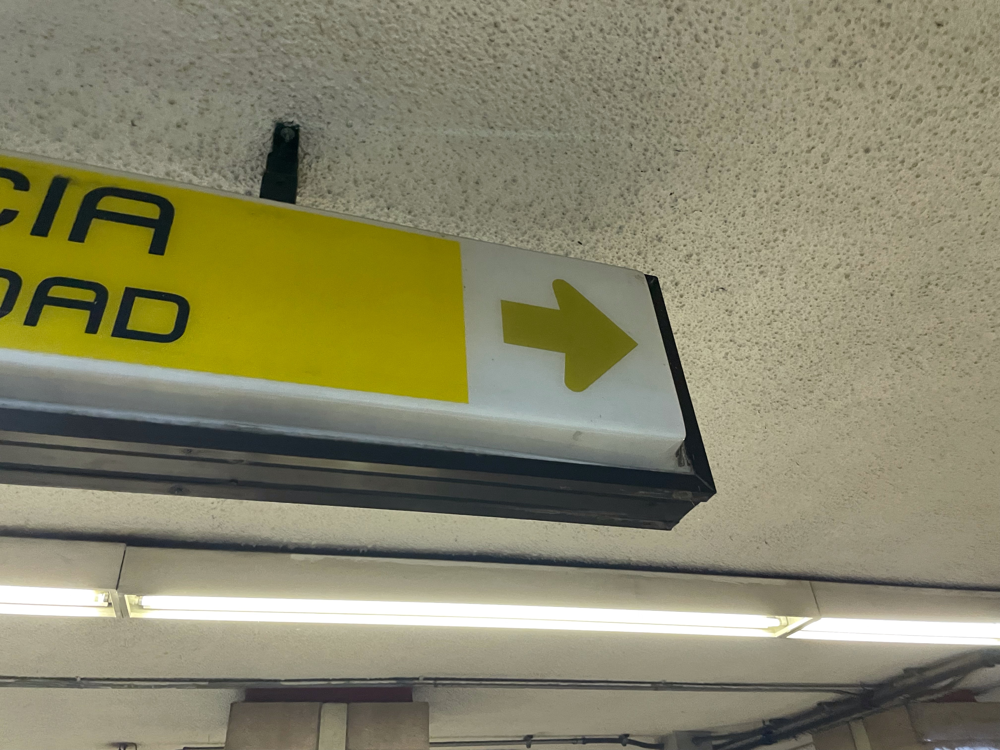
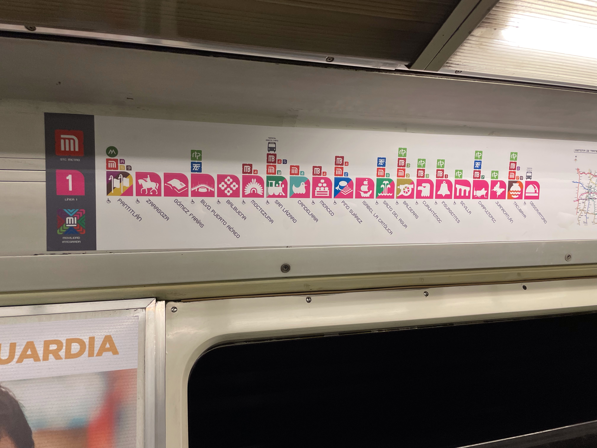
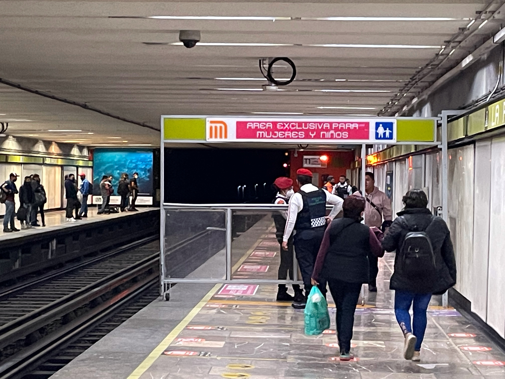
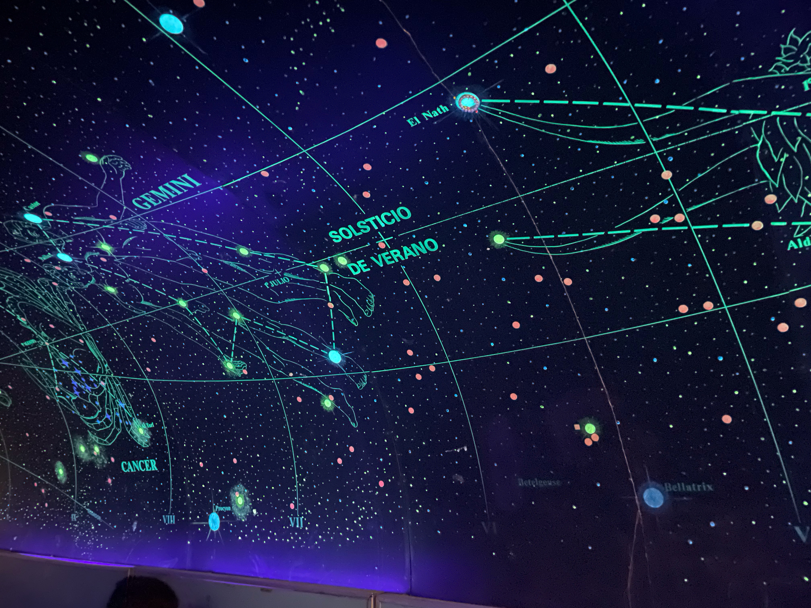
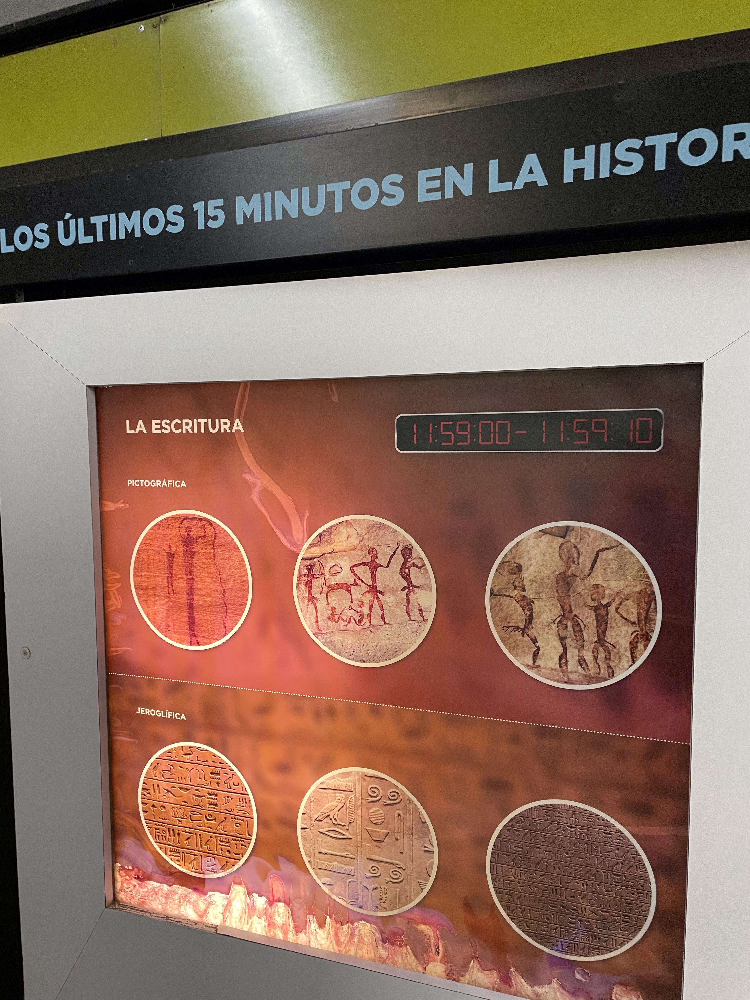

---
title: "Metro in Mexico"
date: "21 July, 2021"
read: "5 min read"
topic: "travel"
image: ../../../images/mexico/2021/metro/1.jpg
--- 

Using the metro in Mexico City really nice compared compared to the Germany (it differs from city to city though). In CDMX you pay $3 peso and can drive around the city until you leave the metro. You can change stations and even switch to bus and back. All for under 0.15€ 

All you need is a metro card with some credit and your good to go!
You can see there are different modes of transport available in CDMX.
There is the subway of course, but also metrobuses, bicycles, lifts and more. All modes are included in the $3 peso. Use as many as you want until you leave the metro area of the city.

## Getting a card

 
In front of the metro area you can either find counters or machines like this or both. In case of the automates just put in some money and you get a card. If you already have a card and want to top it up, put in the card first and then put in some pesos. (Max $120 peso at s time)

## Navigating the Metro with icons and colors

As you can see on the map, in Mexico City each metro line has its own color. For example on the station ‘Autobuses del Norte’ there is the yellow line. (You cannot see the station on the picture)

Inside the metro area these colors can be seen anywhere and reference the according line. (Orange in this case)

 
Since the metro stations tend to be quiet large (sometimes you need walk 5 minutes to the place you want) there are many colored signs that help you find the correct way to your destination. Without them I would have gotten lost so many times 😅

 
Each station has a unique icon associated with it. That helps a lot when you are not familiar with the names of the different stations.

## Sections

 
In the first section is exclusively reserved for women and children (for buses or the subway). This is optional since they can enter all parts of the vehicle. The entries to these station are almost everywhere guarded by private security or police.

The last section often gets used to do some kinky stuff and you can sometimes see people fucking. Certainly, a fun way to travel. 😂

Men can enter any section but the first.

I think this is a good way to improve the security of women, especially at night.

## Expositions and Trivia

In many stations, they are Expositions of different museums displayed on the walls and even some statues in the walking area. Topics vary but everything is pretty interesting and it makes walking to your train more entertaining and by the way (pun intended) educative.

For this beautiful artwork of the night sky the turned of the lights of around 50 meter walkway and stationed 2 officers there.

This is one of many posters themed around anthropology. It attempts to teach you the most important events of the human history and evolution in around 15 minutes.

I love the metro in Mexico City and I hope that other countries use this of an example how to urban transportation right.

Hope this helps you!
